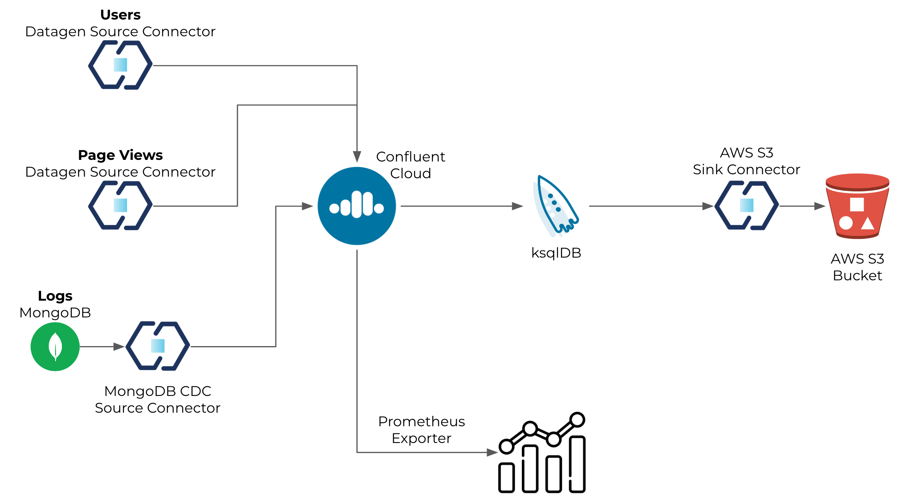

# Overview

This Confluent Cloud setup guide will help you to setup a base cluster in your Confluent Cloud account.



# Installation (only need to do that once)

Install Terraform
```
brew tap hashicorp/tap
brew install hashicorp/tap/terraform
brew update
brew upgrade hashicorp/tap/terraform
```

Install jq
```
brew install jq
```

Install curl
```
brew install curl
```

# Provision CC/AWS services for the demo
## Set environment variables
Confluent Platform
```
export CONFLUENT_CLOUD_API_KEY="Enter credentials here"
export CONFLUENT_CLOUD_API_SECRET="Enter credentials here"
```
AWS
```
export AWS_ACCESS_KEY_ID="Enter credentials here"
export AWS_SECRET_ACCESS_KEY="Enter credentials here"
```

Terraform initialisation
```
terraform init
```

Terraform plan
```
terraform plan
```

Terraform apply
```
terraform apply
```

Login to Confluent Cloud: https://confluent.cloud/