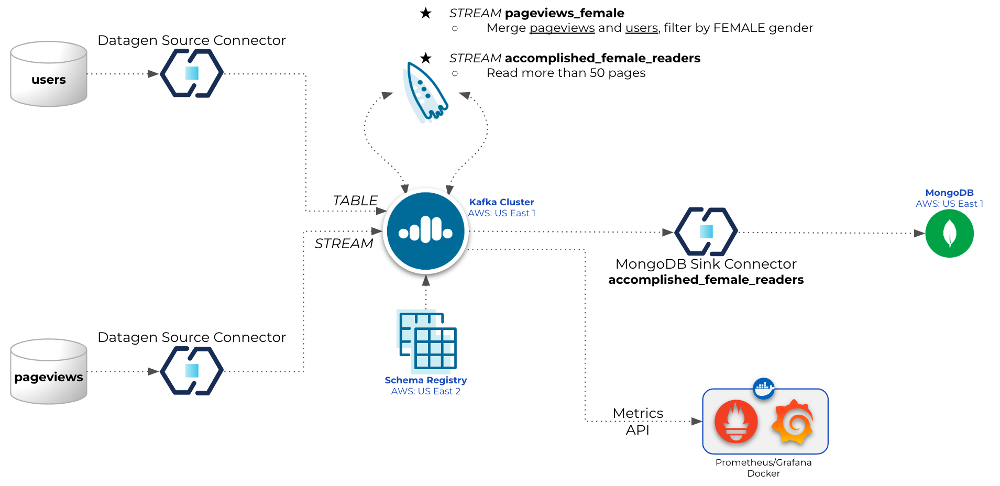
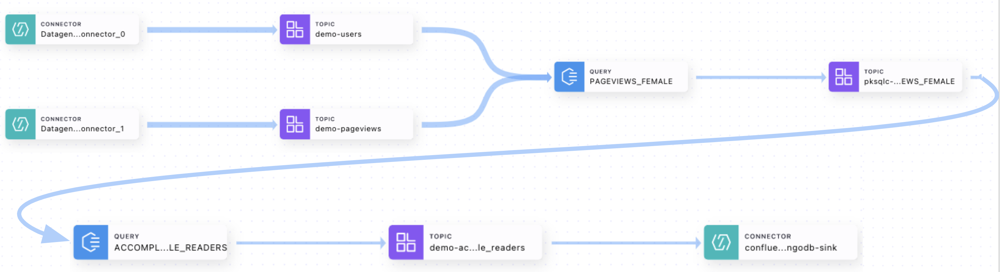

# Overview

This Confluent Cloud setup guide will help you to setup a basic cluster in your Confluent Cloud account.



# Pre-requisites
- User account on [Confluent Cloud](https://www.confluent.io/confluent-cloud/tryfree/)
- Local install of [Docker Desktop](https://docs.docker.com/get-docker/)
- Local install of Terraform (details below)
- Local install of jq/curl (details below)
- User account on [Atlas MongoDB](https://account.mongodb.com/account/login)

# Installation (only need to do that once)

## Install Terraform
```
brew tap hashicorp/tap
brew install hashicorp/tap/terraform
brew update
brew upgrade hashicorp/tap/terraform
```

## Install jq
```
brew install jq
```

## Install curl
```
brew install curl
```

## Docker
Start docker desktop (required, otherwise Prometheus/Grafana will not work)

# Provision services for the demo

## Set environment variables
Confluent Platform
```
export CONFLUENT_CLOUD_API_KEY="Enter credentials here"
export CONFLUENT_CLOUD_API_SECRET="Enter credentials here"
```
MongoDB Atlas
```
export MONGODB_ATLAS_PUBLIC_KEY="Enter credentials here"
export MONGODB_ATLAS_PRIVATE_KEY="Enter credentials here"
export MONGODB_ATLAS_PROJECT_ID="Enter MongoDB Atalas Project ID here"
export MONGODB_ATLAS_PUBLIC_IP_ADDRESS="Enter the CIDR range(s) allowed to access MongoDB (including your own public WAN IP CIDR), or allow all, for example: 0.0.0.0/0"
```

## Initialize a new or existing Terraform working directory
```
terraform init
```

## Generates a speculative execution Terraform plan
```
terraform plan
```

## Creates or updates infrastructure according to Terraform configuration files (it should take 10 to 15mins to complete)
```
terraform apply
```

## View Grafana dashboards
Open local instance of Prometheus (http://localhost:9090)

Open local instance of Grafana (http://localhost:3000)
 - Credentials
   - userid: admin
   - password: password
 - Select Option to Browse Dashboards
 - Open Confluent Cloud Dashboard

Based on https://github.com/confluentinc/jmx-monitoring-stacks/tree/7.2-post/ccloud-prometheus-grafana


## Destroy Terraform-managed infrastructure (once done with the demo)
```
terraform destroy
```

# Demo details
1. Create Environment on Confluent Cloud (`https://confluent.cloud/`) named `demo-terraform-XXXXXXXX` (where `XXXXXXXX` is a random hexadecimal value, e.g., `a492d37e`)
2. Create Schema Registry on AWS us-east-2
3. Create Basic/single-zone Kafka cluster on AWS us-east-1 named `cc-demo-cluster`
4. Create ksqlDB cluster named `ksql-dev-cluster-XXXXXXXX`
- Tables:
  - USERS<br>
 `CREATE TABLE IF NOT EXISTS users (id STRING PRIMARY KEY) WITH (kafka_topic='demo-users', value_format='AVRO');`
- Streams:
  - PAGEVIEWS<br>
 `CREATE STREAM IF NOT EXISTS pageviews WITH (kafka_topic='demo-pageviews', value_format='AVRO');`
  - PAGEVIEWS_FEMALE<br>
 `CREATE STREAM IF NOT EXISTS pageviews_female AS SELECT users.id AS userid, pageid, regionid, gender FROM pageviews LEFT JOIN users ON pageviews.userid = users.id WHERE gender = 'FEMALE' EMIT CHANGES`
  - ACCOMPLISHED_FEMALE_READERS<br>
 `CREATE STREAM IF NOT EXISTS accomplished_female_readers WITH (kafka_topic='demo-accomplished_female_readers', value_format='AVRO') AS SELECT * FROM pageviews_female WHERE CAST(SPLIT(PAGEID,'_')[2] as INT) >= 50 EMIT CHANGES;`
5. Create two DataGen source connectors:
- `DSC_users` sourcing data to the topic `demo-users`, example:
```
{
  "registertime": 1503444855507,
  "userid": "User_1",
  "regionid": "Region_9",
  "gender": "MALE"
}

Schema:
{
  "connect.name": "ksql.users",
  "fields": [
    {
      "name": "registertime",
      "type": "long"
    },
    {
      "name": "userid",
      "type": "string"
    },
    {
      "name": "regionid",
      "type": "string"
    },
    {
      "name": "gender",
      "type": "string"
    }
  ],
  "name": "users",
  "namespace": "ksql",
  "type": "record"
}
```
- `DSC_pageviews` sourcing data to the topic `demo-pageviews`, example:
```
{
  "viewtime": 1341,
  "userid": "User_6",
  "pageid": "Page_38"
}

Schema:
{
  "connect.name": "ksql.pageviews",
  "fields": [
    {
      "name": "viewtime",
      "type": "long"
    },
    {
      "name": "userid",
      "type": "string"
    },
    {
      "name": "pageid",
      "type": "string"
    }
  ],
  "name": "pageviews",
  "namespace": "ksql",
  "type": "record"
}
```
6. Create MongoDB `M0` (free tier) cluster on AWS us-east-1 named `terraformDemo` (IMPORTANT: Only one free-tier cluster is allowed per Atlas account)
7. Add entry to the Network Access tab (Atlas):
 - IP Address: 0.0.0.0/0 (or as set on env variable MONGODB_ATLAS_PUBLIC_IP_ADDRESS)
 - Comment: cidr block for terraformDemo
8. Add entry to the Database Access tab (Atlas):
 - User name: mongodb-demo
 - Password: 16 chars randomly generated
   - Type `terraform output -json` after running `terraform apply` to view the password and MongoDB connection string
 - Auth Method: SCRAM
 - MongoDB Roles:
   - readWrite@confluent_demo
   - dbAdmin@confluent_demo
 - Resources: All resources
9. MongoDB Database named `terraformDemo`
10. Create MongoDB Atlas Sink connector named `confluent-mongodb-sink`
 - A new collection will be created to the MongoDB database named `confluent_demo.accomplished_female_readers`, see example of document below (from topic `demo-accomplished_female_readers`)
 ```
_id: 63fcedd6f11f041d35ce6f88
PAGEID: "Page_83"
REGIONID: "Region_1"
GENDER: "FEMALE"
 ```
11. The Terraform code will also create Service Accounts, ACLs and API Keys
12. Run docker compose (`docker-compose.yaml`)

# Terraform files
- `vars.tf`: Main system variables (change it as needed)
- `providers.tf`:
  - confluentinc/confluen
  - mongodb/mongodbatlas
  - scottwinkler/shell (To provision ksqlDB SQL tables/streams via HTTPS)
  - hashicorp/external (To read env variables)
- `cflt_cloud.tf`: 
  - Confluent Cloud Environment
  - Schema Registry
  - Apache Kafka Cluster
  - Service Accounts (app_manager, sr, clients)
  - Role Bindings (app_manager, sr, clients)
  - Credentials / API Keys (app_manager, sr, clients)
- `cflt_connectors.tf`:
  - Service Accounts (Connectors)
  - Access Control List
  - Credentials / API Keys
  - Create Kafka topics for the DataGen Connectors
  - DataGen Connectors
- `cflt_ksqldb.tf`:
  - Service Accounts (ksqlDB)
  - Role Bindings (ksqlDB, ksqlDB for SR)
  - ksqlDB Dev Cluster
  - Credentials / API Keys (REST Management)
  - SQL Queries (Shell scripts) 
- `mongodb.tf`:
  - Create free tier cluster (only one allowed per Atlas account)
  - Whitelist IP Address
  - Create DB user
  - MongoDB Sink Connector
- `docker_grafana.tf`:
  - Start Prometheus and Grafana (local instances using docker)

Stream lineage on Confluent Cloud:


