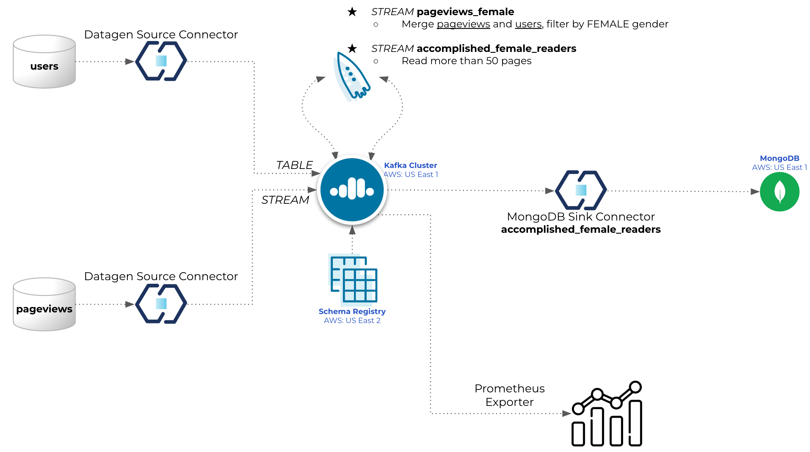

# Overview

This Confluent Cloud setup guide will help you to setup a base cluster in your Confluent Cloud account.



# Installation (only need to do that once)

## Install Terraform
```
brew tap hashicorp/tap
brew install hashicorp/tap/terraform
brew update
brew upgrade hashicorp/tap/terraform
```

## Install jq
```
brew install jq
```

## Install curl
```
brew install curl
```

# Provision CC/AWS services for the demo

## Set environment variables
AWS
```
export AWS_ACCESS_KEY_ID="Enter credentials here"
export AWS_SECRET_ACCESS_KEY="Enter credentials here"
```
Confluent Platform
```
export CONFLUENT_CLOUD_API_KEY="Enter credentials here"
export CONFLUENT_CLOUD_API_SECRET="Enter credentials here"
```
MongoDB Atlas
```
export MONGODB_ATLAS_PUBLIC_KEY="Enter credentials here"
export MONGODB_ATLAS_PRIVATE_KEY="Enter credentials here"
export MONGODB_ATLAS_PROJECT_ID="Enter MongoDB Atalas Project ID here"
export MONGODB_ATLAS_PUBLIC_IP_ADDRESS="Enter your public IP/CIDR address, e.g. 90.252.44.153/32"
```

## Terraform initialisation
```
terraform init
```

## Terraform plan
```
terraform plan
```

## Terraform apply
```
terraform apply
```

## View MongoDB connection string and password
```
terraform output -json
```

Login to Confluent Cloud: `https://confluent.cloud/`

# PENDING:
- MongoDB script to generate data + CDC connector
- Metrics (Prometheus Exporter)